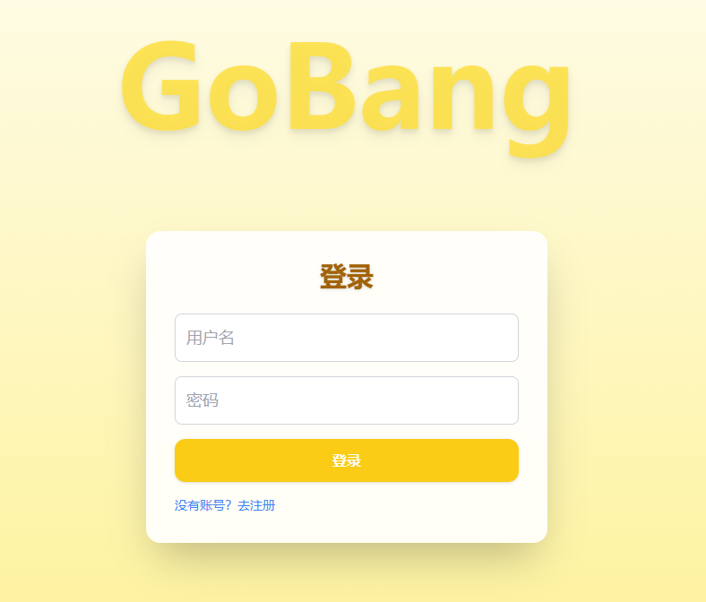
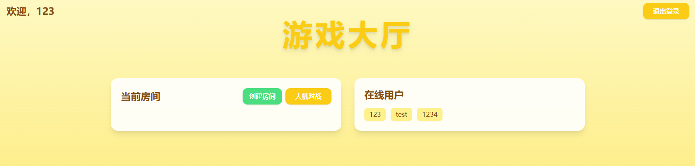
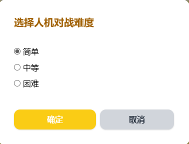
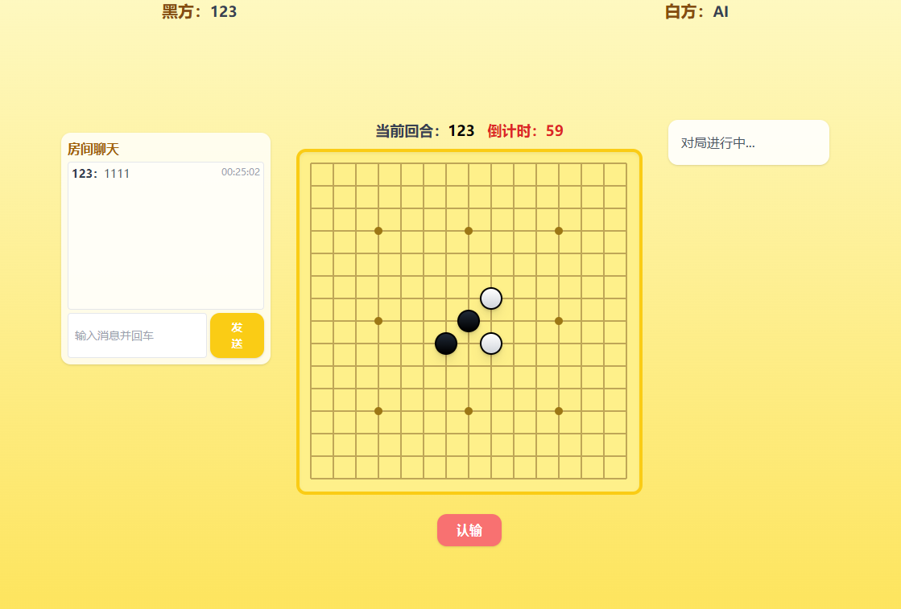

---

# Gobang 五子棋对战平台

## 项目简介

本项目是一个支持**在线对战**和**人机对战**的五子棋平台，前端基于 Vue3 + TailwindCSS 实现，后端使用 C++ 手写 HTTP 和 WebSocket 服务，并结合 MySQL 实现用户、房间等数据管理。支持大厅房间、实时聊天、AI 对弈（极大极小+棋型评估），可适配多种部署环境。

---

## 目录结构

```
ai-gobang-web/
├── gobang-server/           # C++ 后端源码 (HTTP/WebSocket/AI)
│   ├── main.cpp
│   ├── CMakeLists.txt
│   ├── db/                  #数据库封装
│   ├── gobang/              #核心算法
│   ├── model/               #数据管理
│   ├── service/             #功能封装
│   ├── network/             #网络与前端接口
│   ├── utils/               #工具封装
│  
├── gobang-web/          # 前端 Vue3 项目
│   ├── src/
│   │   ├── pages/
│   │   ├── utils/
│   │   ├── App.vue
│   │   ├── main.js
│   ├── public/
│   ├── package.json
│   └── vite.config.js
├── db.sql             # MySQL 数据表结构 (示例)
├── vx_images          # 部分UI截图
└── README.md          # 项目说明文档


```

---

## 技术栈

* **前端**：Vue3 + Vite + TailwindCSS 
* **后端**：C++11/14，手写 HTTP + WebSocket（无第三方框架），AI 对手(极大极小+棋型评估)
* **数据库**：MySQL 5.7/8.0

---

## 功能亮点

* 实时在线匹配与对战（房间大厅）
* 支持房间观战、准备、认输等操作
* 实时房间/大厅聊天
* 支持人机对战，三种难度（easy/normal/hard）
* 用户登录注册、房间密码、AI房间不计入房间列表
* 前端响应式适配、多端可访问
* 支持 nginx 反向代理生产部署

---

## 部分UI截图

---



--- 



--- 



--- 



--- 


## 1. 数据库设计

### 1.1 表结构（示例）

### 1. 用户表（users）

|    字段名    |     类型     | 主键 |       约束       |         说明         |
| ----------- | ----------- | ---- | --------------- | -------------------- |
| id          | INT         | √    | AUTO\_INCREMENT | 用户唯一ID            |
| username    | VARCHAR(32) |      | UNIQUE          | 用户名               |
| password    | VARCHAR(64) |      | NOT NULL        | 密码                 |
| email       | VARCHAR(64) |      |                 | 邮箱                 |
| token       | VARCHAR(64) |      |                 | 当前登录token（可选） |
| is\_online  | TINYINT(1)  |      | DEFAULT 0       | 在线状态              |
| last\_login | DATETIME    |      |                 | 上次登录时间          |
| created\_at | DATETIME    |      |                 | 注册时间              |
   
---

### 2. 房间表（rooms）

| 字段名         | 类型                               | 主键 | 约束                | 说明           |
| ----------- | -------------------------------- | -- | ----------------- | ------------ |
| id          | INT                              | √  | AUTO\_INCREMENT   | 房间唯一ID       |
| name        | VARCHAR(32)                      |    | NOT NULL          | 房间名称         |
| password    | VARCHAR(64)                      |    |                   | 房间密码Hash（如有） |
| status      | ENUM('waiting','playing','full') |    | DEFAULT 'waiting' | 房间状态         |
| created\_by | INT                              |    |                   | 创建者用户ID      |
| created\_at | DATETIME                         |    |                   | 创建时间         |
| updated\_at | DATETIME                         |    |                   | 最后更新时间       |

---

### 3. 房间成员表（room\_members）

| 字段名        | 类型                                | 主键 | 约束                  | 说明   |
| ---------- | --------------------------------- | -- | ------------------- | ---- |
| id         | INT                               | √  | AUTO\_INCREMENT     | 自增ID |
| room\_id   | INT                               |    | NOT NULL            | 房间ID |
| user\_id   | INT                               |    | NOT NULL            | 用户ID |
| role       | ENUM('black','white','spectator') |    | DEFAULT 'spectator' | 身份   |
| ready      | TINYINT(1)                        |    | DEFAULT 0           | 是否准备 |
| joined\_at | DATETIME                          |    |                     | 加入时间 |

> 说明：同一房间黑白玩家+观战/准备状态全部由此表维护，离开房间即删除此表记录。

---

### 4. 对局/棋谱表（games）

| 字段名         | 类型          | 主键 | 约束              | 说明               |
| ----------- | ----------- | -- | --------------- | ---------------- |
| id          | INT         | √  | AUTO\_INCREMENT | 对局ID             |
| room\_id    | INT         |    | NOT NULL        | 房间ID             |
| black\_user | INT         |    | NOT NULL        | 黑方用户ID           |
| white\_user | INT         |    | NOT NULL        | 白方用户ID           |
| winner      | INT         |    |                 | 胜者用户ID           |
| reason      | VARCHAR(32) |    |                 | 结束原因（五连/认输/超时）   |
| moves       | TEXT        |    |                 | 棋谱（JSON序列化：数组形式） |
| started\_at | DATETIME    |    |                 | 开始时间             |
| ended\_at   | DATETIME    |    |                 | 结束时间             |

---

### 5. 聊天/消息表（room\_messages）

|  字段名   |     类型      | 主键 |       约束       |    说明    |
| -------- | ------------ | ---- | --------------- | ---------- |
| id       | INT          | √    | AUTO\_INCREMENT | 自增ID     |
| room\_id | INT          |      | NOT NULL        | 房间ID     |
| user\_id | INT          |      | NOT NULL        | 发送用户ID |
| content  | VARCHAR(512) |      | NOT NULL        | 消息内容   |
| sent\_at | DATETIME     |      |                 | 发送时间   |


> AI房间不入库，使用内存管理。
>有部分表未使用到，但是留出了接口
### 1.2 初始化

1. 创建数据库并导入以上表结构。
2. 修改后端 `db/dbconn.h` 里的数据库连接信息为你的实际参数。

---

## 2. 后端部署与启动

### 2.1 编译环境

* Ubuntu 20.04/22.04 推荐
* g++ ≥ 7.5（需支持 C++11/14）
* 安装依赖：

  ```bash
  sudo apt-get update
  sudo apt-get install build-essential libmysqlclient-dev cmake
  ```

### 2.2 编译后端

```bash
cd backend/
mkdir build && cd build
cmake ..
make -j
# 生成 ./gobang_server
```

### 2.3 启动服务

```bash
# 启动 HTTP 服务（默认 5555）和 WebSocket 服务（默认 5566）
./gobang_server
```

* 推荐用 `nohup ./gobang_server &` 或 `systemctl` 持久化运行

---

## 3. 前端部署与打包

### 3.1 安装依赖

```bash
cd frontend/
npm install
```

### 3.2 本地开发

```bash
npm run dev
# 默认 http://localhost:5173
```

### 3.3 构建发布版

```bash
npm run build
# 生成 dist/ 静态资源
```

### 3.4 生产部署（Nginx 推荐配置）

将 `dist/` 目录部署到服务器如 `/var/www/gobang/dist`，nginx 配置如下：

```nginx
server {
    listen 80;
    server_name 你的服务器IP或域名;

    root /var/www/gobang/dist;
    index index.html;

    location / {
        try_files $uri $uri/ /index.html;
    }

    location /api/ {
        proxy_pass http://127.0.0.1:5555;
        proxy_set_header Host $host;
        proxy_set_header X-Real-IP $remote_addr;
        proxy_set_header X-Forwarded-For $proxy_add_x_forwarded_for;
    }
    location /ws/ {
        proxy_pass http://127.0.0.1:5566;
        proxy_http_version 1.1;
        proxy_set_header Upgrade $http_upgrade;
        proxy_set_header Connection "Upgrade";
        proxy_set_header Host $host;
    }
}
```

**重载 nginx：**

```bash
sudo nginx -t
sudo systemctl reload nginx
```

---

## 4. 主要交互流程

### 4.1 用户登录/注册

* `/api/auth/login`  `/api/auth/register`
* 前端页面通过 axios 发送请求，后端验证密码、生成 token。

### 4.2 房间大厅/在线列表

* `/api/rooms` 获取房间列表
* `/api/users/online` 获取在线用户

### 4.3 房间操作

* `/api/rooms` POST 创建房间
* `/api/rooms/join` 加入房间
* `/api/rooms/bot` 创建AI房间（参数：user\_id, level）

### 4.4 实时对战通信（WebSocket）

* 连接：`ws://服务器:5566/ws?token=xxx`
* 消息协议（JSON）：

  * join\_room, ready, chess\_move, chat, giveup, leave\_room
  * 具体格式见 `/frontend/src/utils/ws.js` 与后端 websocket\_server.cpp

---

## 5. AI算法说明

* AI采用极大极小+alpha-beta剪枝+棋型评估
* 三种难度对应不同搜索深度及候选扩展数量
* 支持识别多种棋型（五连、活四、冲四、活三、眠三、跳活三等）
* AI房间仅存在于内存，退出即销毁

---

## 6. 常见问题与排查

* 403 Forbidden：检查 nginx root 路径和文件权限
* 500 Internal Server Error：后端异常，检查后端日志
* WebSocket无法连接：防火墙/端口未开/配置错误
* 用户离开房间数据未清理：前端需发送 websocket 的 leave\_room，同时建议补充 http 的退出房间接口，后端统一清理

---

## 7. 其他说明

* 本项目所有代码均开源、易于拓展，支持接入更多AI策略和前端美化
* 项目已适配多浏览器，推荐使用 Chrome/Edge 最新版
* **建议：** 保持前后端 token 校验逻辑一致，生产环境下 token 建议增加时效性和加密处理

---


